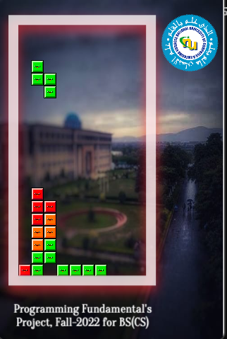

  
# Tetris Game - SFML C++

This is a classic Tetris game developed in C++ using the SFML (Simple and Fast Multimedia Library) as part of the Programming Fundamentals project for Fall 2022 BS(CS). The game features two difficulty levels, unique bomb mechanics, sound effects, and a grid-shortening challenge to enhance gameplay.

## Features
- **Two Difficulty Modes**:
  - **Beginner**: 5 block types with slower fall speed.
  - **Advanced**: 7 block types with faster fall speed.
- **Bomb Mechanic**: A special bomb block appears every 20 blocks, clearing the entire grid or a 2x2 area based on color matching, with unique sound effects.
- **Dynamic Gameplay**:
  - Move blocks left/right, rotate, soft drop, or hard drop using keyboard controls.
  - Grid shortens every 30 block falls, increasing challenge.
- **Scoring System**:
  - Points for clearing 1–4 lines (10, 30, 60, 100 points respectively).
  - Bonus points for bomb clears (100 for full grid, 10 for 2x2 area).
- **SFML Graphics and Audio**: Smooth visuals with block sprites and background music, plus sound effects for rotation, movement, and bomb explosions.
- **Game Over Detection**: Ends when the top row is filled, displaying total lines cleared, bomb clears, and final score.

## Installation
1. **Install SFML**:
   - Download and set up SFML for your platform from [sfml-dev.org](https://www.sfml-dev.org).
   - Ensure SFML libraries are linked in your project (graphics, window, system, audio).
2. **Clone the Repository**:
   ```bash
   git clone https://github.com/salmansaleem08/Tetris-Game-SFML-CPP.git
   cd Tetris

3. **Build the Project**:
   - **Using CMake (recommended)**:
     ```bash
     mkdir build
     cd build
     cmake ..
     make
     ```
   - **Manual Compilation (example with g++)**:
     ```bash
     g++ -c main.cpp -I/path/to/sfml/include
     g++ main.o -o tetris -L/path/to/sfml/lib -lsfml-graphics -lsfml-window -lsfml-system -lsfml-audio
     ```

4. **Run the Game**:
   ```bash
   ./tetris
   ```
   **Note**: Ensure the `img` folder is in the same directory as the executable.

---

## How to Play

### Controls
- **Arrow Keys**: Move the blocks (Left, Right, Up, Down).
- **Space Bar**: Hard drop


## Project Structure

```
SpaceShooterSFML/
├── img/                # Game sprites and textures
├── *.cpp               # Source files
├── *.h                 # Header files
└── README.md           # Project documentation

```

---


## Dependencies

- **SFML**: Handles graphics, audio, and window management.
- **C++ Standard Library**: For file handling, random number generation, and more.

---

## Contributing

Contributions are welcome! To contribute:

1. Fork the repository.
2. Create a new branch:
   ```bash
   git checkout -b feature-name
   ```
3. Make your changes and commit:
   ```bash
   git commit -m "Add feature"
   ```
4. Push to your branch:
   ```bash
   git push origin feature-name
   ```
5. Open a Pull Request.

**Please ensure your code follows the project's coding style and includes relevant tests.**

---

**Built by Muhammad Salman Saleem**  
*Feel free to star ⭐ this repository if you enjoyed the game!*

